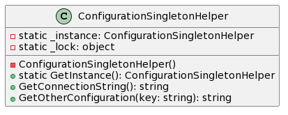

# Singleton

## What is Singleton?

Singleton is a creational design pattern that lets you ensure that a class has only one instance, while providing a global access point to this instance.

## Pros and Cons

- Pros

1. You can be sure that a class has only a single instance.
2. You gain a global access point to that instance.
3. The singleton object is initialized only when it’s requested for the first time.

- Cons

1. Violates the Single Responsibility Principle. The pattern solves two problems at the time.
2. The Singleton pattern can mask bad design, for instance, when the components of the program know too much about each other.
3. The pattern requires special treatment in a multithreaded environment so that multiple threads won’t create a singleton object several times.
4. It may be difficult to unit test the client code of the Singleton because the constructor of the singleton class is private and overriding static methods is impossible in most languages, you will need to think of a creative way to mock the singleton. Or just don’t write the tests (Yes, it's a bad, but can be a reality)...

## Diagram of this sample

This sample is a simple implementation of the Singleton pattern. 

The `ConfigurationSingletonHelper` class has a static method that returns its instance. 

The constructor of the class is hidden from the outside world. Only this `getInstance` method can create an object of the class and return it to the caller.

The `_lock` object is used to synchronize threads during first access to the Singleton object (It is possible make a singleton thread safe).

---
By [https://www.fabiodeveloper.com](fabioDeveloper.com) - Every person is unique! Enjoy it :-)